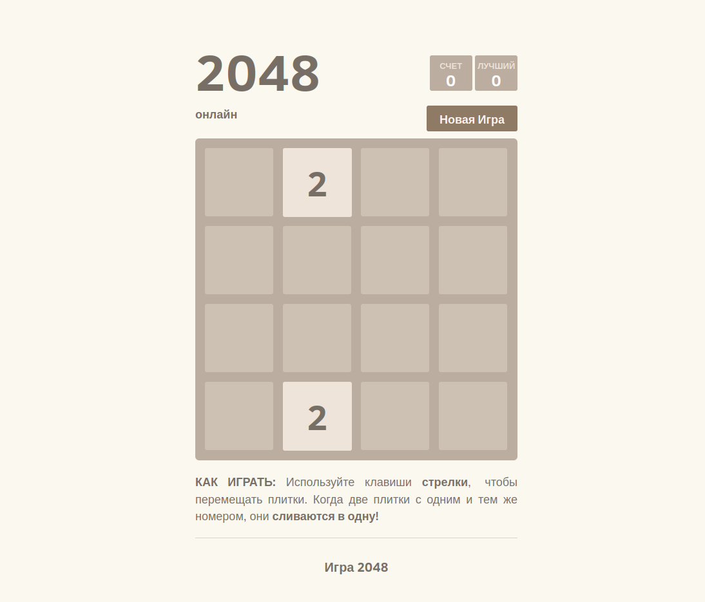

# 2048 Game

1. В каждом раунде появляется плитка номинала «2» (с вероятностью 90 %) или «4» (с вероятностью 10 %)
2. Нажатием стрелки игрок может скинуть все плитки игрового поля в одну из 4 сторон. Если при сбрасывании две плитки
  одного номинала «налетают» одна на другую, то они превращаются в одну, номинал которой равен сумме соединившихся плиток.
  После каждого хода на свободной секции поля появляется новая плитка номиналом «2» или «4». Если при нажатии кнопки
  местоположение плиток или их номинал не изменится, то ход не совершается.
3. Если в одной строчке или в одном столбце находится более двух плиток одного номинала, то при сбрасывании они начинают
   соединяться с той стороны, в которую были направлены. Например, находящиеся в одной строке плитки (4, 4, 4) после хода
   влево превратятся в (8, 4), а после хода вправо — в (4, 8). Данная обработка неоднозначности позволяет более точно
   формировать стратегию игры.
4. За каждое соединение игровые очки увеличиваются на номинал получившейся плитки.
5. Игра заканчивается поражением, если после очередного хода невозможно совершить действие.

Использование максимально простое, достаточно просто скачать или клонировать данный репозиторий и запустить индексный файл (index.html)
