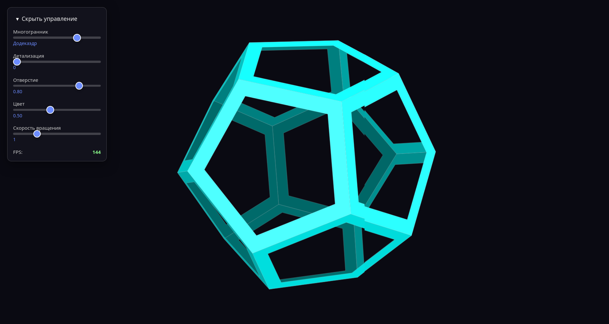

# 3D Polyhedra Library

[](https://www.npmjs.com/package/3d-polyhedra)
[](https://opensource.org/licenses/MIT)
[](https://www.typescriptlang.org/)
[](https://vitejs.dev/)

**Interactive 3D polyhedra renderer with smooth subdivision, real-time lighting, and intuitive controls.**



<!-- TOC -->
* [3D Polyhedra Library](#3d-polyhedra-library)
  * [Features](#features)
  * [Installation](#installation)
    * [For library usage](#for-library-usage)
    * [For development / demo](#for-development--demo)
  * [Demo](#demo)
  * [Usage Examples](#usage-examples)
    * [Simple renderer setup](#simple-renderer-setup)
    * [Dynamic updates](#dynamic-updates)
    * [Low-level control](#low-level-control)
  * [More Examples](#more-examples)
  * [API Reference](#api-reference)
    * [`Renderer`](#renderer)
      * [Constructor](#constructor)
      * [Methods](#methods)
      * [Properties](#properties)
    * [Types](#types)
    * [Low-level Components](#low-level-components)
  * [Project Structure](#project-structure)
  * [Build & Development](#build--development)
    * [Commands](#commands)
    * [Library Build Output](#library-build-output)
  * [Browser Support](#browser-support)
  * [Contributing](#contributing)
  * [License](#license)
  * [Contact](#contact)
<!-- TOC -->

## Features

- **5 Platonic Solids** – Tetrahedron, Cube, Octahedron, Dodecahedron, Icosahedron
- **Dynamic Subdivision** – level 0–4 for smooth surfaces
- **Interactive Controls** – mouse drag rotation, touch support
- **Real-time Lighting** – dynamic directional light based on pointer position
- **Hole Effect** – configurable aperture for wireframe-like style
- **Color Palette** – hue shift and random per-face colors
- **Performance** – optimized with FPS counter
- **Framework Agnostic** – pure TypeScript, no external dependencies (only for development)

---

## Installation

### For library usage

```bash
npm install @alekstar79/3d-polyhedra
```

### For development / demo

Clone the repository and install dependencies:

```bash
git clone https://github.com/alekstar79/3d-polyhedra.git
cd 3d-polyhedra
npm install
```

---

## Demo

Run the demo locally:

```bash
npm run dev
```

Open [http://localhost:3000](http://localhost:3000) to see the interactive 3D scene with control panel.

To build the demo for production:

```bash
npm run build:demo
```

The output will be in the `dist` folder.

---

## Usage Examples

Below are two primary ways to use the library – the high-level `Renderer` and low-level components for full control.

### Simple renderer setup

The easiest way to get started is to use the `Renderer` class. It handles all the rendering, animation loop, and interaction.

```typescript
import { Renderer } from '@alekstar79/3d-polyhedra';

const canvas = document.getElementById('canvas') as HTMLCanvasElement;

const renderer = new Renderer({
  canvas,
  polyhedronType: 3,   // Dodecahedron
  division: 1,
  hole: 0.3,
  color: 0.6,
  speed: 1.5,
});

renderer.start();
```

### Dynamic updates

You can change any parameter on the fly after initialization.

```typescript
// ... after renderer is started

// Switch to Icosahedron with higher subdivision and different color
renderer.update({
  polyhedronType: 4,
  division: 2,
  color: 0.9,
});

// You can also add rotation from external controls (e.g., keyboard)
renderer.addRotation(0.1, 0.05);

// Get current state
const state = renderer.getState();
console.log(state);
```

### Low-level control

For advanced scenarios where you need to customize every step, use the individual components directly.

```typescript
import {
  Icosahedron,
  Projector,
  RotationController,
  LightingCalculator,
  PolyhedronDrawer,
} from '@alekstar79/3d-polyhedra';

const canvas = document.getElementById('canvas') as HTMLCanvasElement;
const ctx = canvas.getContext('2d')!;

// Set up components
const poly = new Icosahedron();
const projector = new Projector([0, 0, 5], 0.5, canvas.width, canvas.height);
const rotation = new RotationController();
const lighting = new LightingCalculator();
lighting.setLightDirection([1, 1, 1]);
const drawer = new PolyhedronDrawer(ctx);

function animate() {
  const matrix = rotation.update(16, 1.0);
  const level = 0;

  const verts = poly.verticesD[level];
  const faces = poly.facesD[level];
  const normals = poly.faceNormalsD[level];
  const centers = poly.faceCentersD[level];
  const colors = poly.colorsD[level];

  // Apply rotation, project, calculate lighting, and draw
  const rotatedVerts = verts.map(v => applyMatrix(v, matrix));
  const rotatedNormals = normals.map(n => applyMatrix(n, matrix));
  const rotatedCenters = centers.map(c => applyMatrix(c, matrix));

  const projectedVerts = projector.projectMany(rotatedVerts);
  const projectedCenters = projector.projectMany(rotatedCenters);
  const intensities = lighting.calculateIntensities(rotatedNormals);

  ctx.clearRect(0, 0, canvas.width, canvas.height);
  drawer.draw(
    projectedVerts,
    faces,
    projectedCenters,
    colors,
    0.0,          // hole size
    intensities,
    0.5           // color parameter
  );

  requestAnimationFrame(animate);
}
animate();

// Helper: apply 3x3 matrix to a vector
function applyMatrix(v: [number, number, number], m: readonly number[]): [number, number, number] {
  const [x, y, z] = v;
  const [m00, m01, m02, m10, m11, m12, m20, m21, m22] = m;
  return [
    m00 * x + m01 * y + m02 * z,
    m10 * x + m11 * y + m12 * z,
    m20 * x + m21 * y + m22 * z,
  ];
}
```

---

## More Examples

The repository includes a dedicated `examples/` folder with ready-to-run TypeScript files that demonstrate real-world use cases:

- **basic-dodecahedron.ts** – minimal setup with a Dodecahedron.
- **subdivision-demo.ts** – shows dynamic subdivision and switching between polyhedra.
- **low-level.ts** – full low-level implementation (same as above but complete).

You can browse or download these files directly from the [examples/](https://github.com/alekstar79/3d-polyhedra/tree/main/examples) folder.

---

## API Reference

### `Renderer`

Main class that orchestrates the rendering pipeline.

#### Constructor

```typescript
new Renderer(config: RendererConfig)
```

| Parameter               | Type                | Description                                                        |
|-------------------------|---------------------|--------------------------------------------------------------------|
| `config.canvas`         | `HTMLCanvasElement` | Canvas element to render on                                        |
| `config.polyhedronType` | `PolyhedronType`    | 0=Tetrahedron, 1=Cube, 2=Octahedron, 3=Dodecahedron, 4=Icosahedron |
| `config.division`       | `number`            | Subdivision level (0–4)                                            |
| `config.hole`           | `number`            | Hole size (0–0.9)                                                  |
| `config.color`          | `number`            | Color hue parameter (0–1.2)                                        |
| `config.speed`          | `number`            | Rotation speed multiplier                                          |

#### Methods

| Method                               | Description                                                   |
|--------------------------------------|---------------------------------------------------------------|
| `update(config: RendererUpdate)`     | Update one or more parameters (partial update)                |
| `getState(): RendererState`          | Returns current full state                                    |
| `start(): void`                      | Starts the animation loop                                     |
| `stop(): void`                       | Stops animation (currently placeholder)                       |
| `resize(): void`                     | Manually trigger resize (handles window resize automatically) |
| `addRotation(deltaX, deltaY): void`  | Add relative rotation (for custom controls)                   |
| `setLightDirection(dir: Vec3): void` | Set light direction vector                                    |

#### Properties

| Property      | Type                    | Description              |
|---------------|-------------------------|--------------------------|
| `onFpsUpdate` | `(fps: number) => void` | Callback for FPS updates |

### Types

```typescript
type PolyhedronType = 0 | 1 | 2 | 3 | 4;

interface RendererConfig {
  canvas: HTMLCanvasElement;
  polyhedronType: PolyhedronType;
  division: number;
  hole: number;
  color: number;
  speed: number;
}

interface RendererState extends RendererConfig {}

type RendererUpdate = Partial<RendererState>;

type Vec3 = readonly [x: number, y: number, z: number];
type Vec2 = readonly [x: number, y: number];
type Mat3 = readonly [ ... ]; // 9 numbers
```

### Low-level Components

If you need more control, you can use individual components:

- `Polyhedron` – base class (extended by `Tetrahedron`, `Cube`, etc.)
- `Projector` – 3D to 2D projection
- `RotationController` – handles rotation accumulation
- `LightingCalculator` – calculates face intensities
- `PolyhedronDrawer` – renders faces on Canvas 2D

---

## Project Structure

```
src/
├── lib/                     # Library source
│   ├── index.ts            # Public API entry
│   ├── types.ts            # Interfaces and types
│   ├── math.ts             # Vector/matrix utilities
│   ├── polyhedron.ts       # Polyhedron classes
│   ├── projector.ts        # Projection logic
│   ├── rotation-controller.ts
│   ├── lighting-calculator.ts
│   ├── polyhedron-drawer.ts
│   └── renderer.ts         # Main renderer
├── demo/                    # Demo application
│   ├── app.ts
│   ├── ui.ts
│   ├── index.html
│   └── styles.css
├── examples/                # Example usage files
│   ├── basic-dodecahedron.ts
│   ├── subdivision-demo.ts
│   └── low-level.ts
├── dist/                    # Built demo (output)
├── lib-dist/                # Built library (for npm)
├── package.json
├── tsconfig.json
├── vite.config.ts          # Demo build config
├── vite.lib.config.ts      # Library build config
└── README.md
```

---

## Build & Development

### Commands

| Command              | Description                                             |
|----------------------|---------------------------------------------------------|
| `npm run dev`        | Start demo dev server (port 3000)                       |
| `npm run build:demo` | Build demo into `dist`                                  |
| `npm run build:lib`  | Build library into `lib-dist` (JS + .d.ts)              |
| `npm run build`      | Build both library and demo                             |
| `npm run preview`    | Preview built demo                                      |
| `npm publish`        | Publish library to npm (runs `build:lib` automatically) |

### Library Build Output

- `lib-dist/polyhedra3d.es.js` – ESM format
- `lib-dist/polyhedra3d.umd.js` – UMD format (for browsers, AMD, CommonJS)
- `lib-dist/index.d.ts` – TypeScript declarations

---

## Browser Support

The library works in all modern browsers that support:
- Canvas 2D
- ES6 modules
- Touch events (for mobile)

Tested on:
- Chrome 90+
- Firefox 88+
- Safari 14+
- Edge 90+
- Mobile Safari/Chrome

---

## Contributing

Contributions are welcome! Please follow these steps:

1. Fork the repository
2. Create a feature branch (`git checkout -b feature/amazing-feature`)
3. Commit your changes (`git commit -m 'Add some amazing feature'`)
4. Push to the branch (`git push origin feature/amazing-feature`)
5. Open a Pull Request

Please ensure your code passes TypeScript strict checks and includes proper tests (if applicable).

---

## License

This project is licensed under the MIT License – see the [LICENSE](LICENSE) file for details.

---

## Contact

- **Author**: [alekstar79](https://github.com/alekstar79)
- **Project Home**: [https://github.com/alekstar79/3d-polyhedra](https://github.com/alekstar79/3d-polyhedra)
- **Issues**: [https://github.com/alekstar79/3d-polyhedra/issues](https://github.com/alekstar79/3d-polyhedra/issues)
