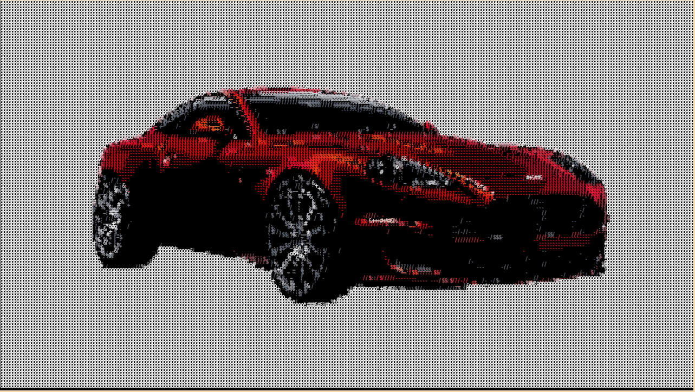

# Convert image to ASCII Art (Franks laboratory).



[DEMO](https://alekstar79.github.io/ascii-art)

## Install and usage

Installing the script is very simple. Clone or download the repository. Start a local server
(LiveServer plugin for VS Code/serve npm package). Or just open the index file in any browser.
That's all...

Clone this repo:
````
git clone git@github.com:alekstar79/ascii-art.git
````
Go to project directory:
````
cd ascii-art
````
Start server:
````
serve -l tcp://localhost:3000 -s .
````
