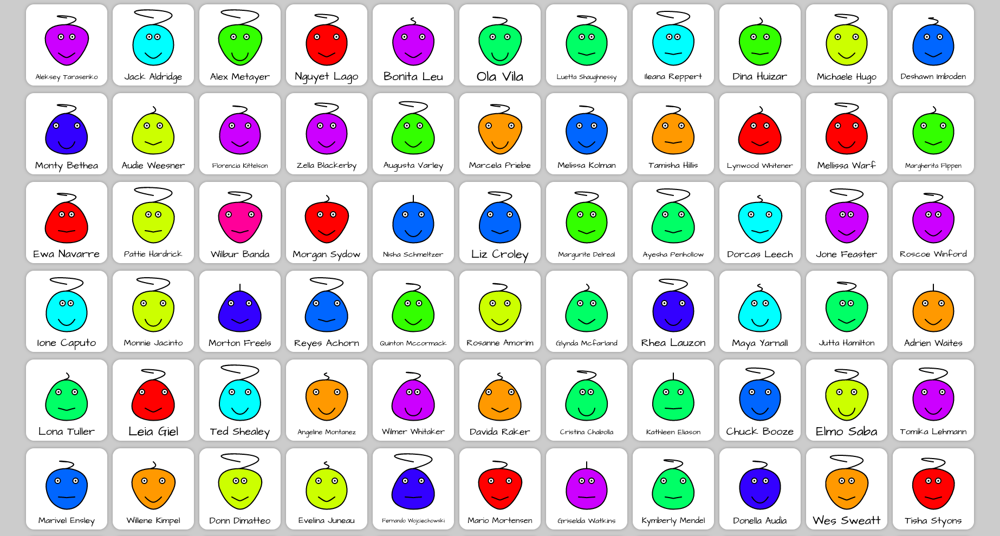

# Avatar Generator



## Install and usage

Installing and running the script, minimalistic. The script does not use build systems and third-party libraries.
Just clone or download the repository. Start local server
(LiveServer plugin for VS Code / [serve](https://github.com/vercel/serve) npm package)
or open index file in browser. That's all...

Clone this repo:
```shell
git clone git@github.com:alekstar79/avatar-generator.git
```
Go to project directory:
```shell
cd avatar-generator
```
Start server:
```shell
serve -s .
```
