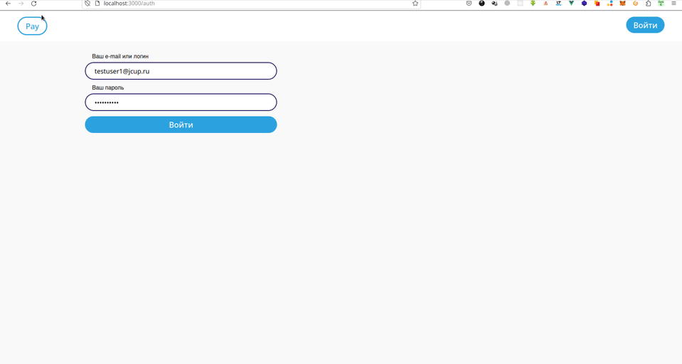

# Awex Pro (A simple client of the Awex crypto platform)



[DEMO](https://alekstar79.github.io/awex-pro)

## Project setup
```
yarn install
```

### Compiles and hot-reloads for development
```
yarn run serve
```

### Compiles and minifies for production
```
yarn run build
```

## CORS

### Addons

[Firefox](https://addons.mozilla.org/en-US/firefox/addon/cors-everywhere)  
[Chrome](https://chrome.google.com/webstore/detail/allow-cors-access-control/lhobafahddgcelffkeicbaginigeejlf)

### Run Chrome browser without CORS:

[Source: Run Chrome without CORS](https://alfilatov.com/posts/run-chrome-without-cors)  
[Stackoverflow: Disable Web Security](https://stackoverflow.com/questions/35432749/disable-web-security-in-chrome-48)

Windows
````
Right click on desktop, add new shortcut
Add the target as "[PATH_TO_CHROME]\chrome.exe" --disable-web-security --disable-gpu --user-data-dir=%LOCALAPPDATA%\Google\chromeTemp
Click OK.
````
OSX
````
open -n -a /Applications/Google\ Chrome.app/Contents/MacOS/Google\ Chrome --args --user-data-dir="/tmp/chrome_dev_test" --disable-web-security
````
Linux
````
google-chrome --disable-web-security
````
