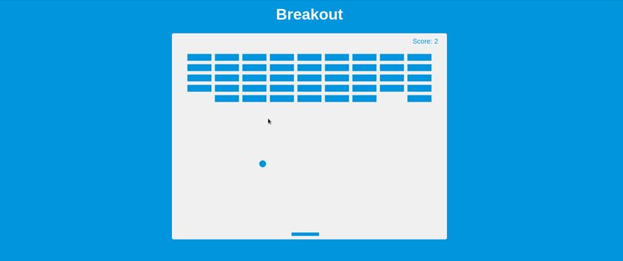

# Breakout Game



[DEMO](https://alekstar79.github.io/breakout)

Game where you control a pad with the arrow keys to bounce a ball up to break bricks.  
Based on [2D breakout game using pure JavaScript](https://developer.mozilla.org/en-US/docs/Games/Tutorials/2D_Breakout_game_pure_JavaScript)


## Install and usage

Installing and running the script, minimalistic. The script does not use build systems and third-party libraries.
Just clone or download the repository. Start local server (LiveServer plugin for VS Code / serve npm package).
Or just open the index file in any browser. That's all...

Clone this repo:
````
git clone git@github.com:alekstar79/breakout.git
````
Go to project directory:
````
cd breakout
````
Start server:
````
serve -l tcp://localhost:3000 -s .
````

## Project Specifications

- Draw elements on canvas
- Use canvas paths to draw shapes
- Add animation with requestAnimationFrame(cb)
- Move pad on arrow key press
- Add collision detection
- Keep score
- Add rules button with slider
