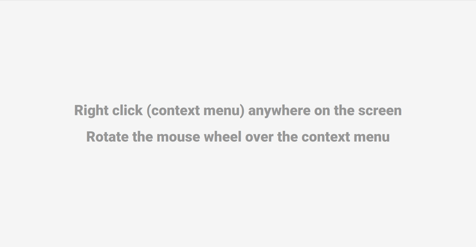

# Context Menu



[DEMO](https://alekstar79.github.io/context-menu/)

Clone this repo:
````shell
git clone git@github.com:alekstar79/context-menu.git
````
Go to project directory:
````shell
cd context-menu
````
Project setup
````shell
yarn install
````
Compiles and hot-reloads for development
````shell
yarn run serve
````
Compiles and minifies for production
````shell
yarn run build
````
