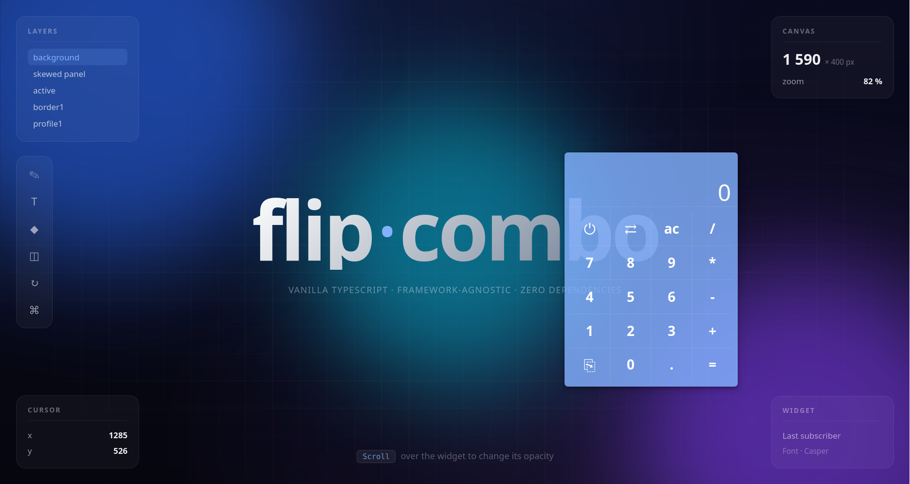

# Vanilla TypeScript calculator + calendar + 3D flipper.

[](https://github.com/alekstar79/flip-combo)
[](https://github.com/alekstar79/flip-combo)
[](https://github.com/alekstar79/flip-combo)
[](https://github.com/alekstar79/flip-combo)
[](https://www.npmjs.com/package/@alekstar79/flip-combo)



- **No frameworks.** No Vue, React, or Angular — pure DOM.
- **No dependencies.** Zero runtime dependencies.
- **Strict TypeScript.** `strict: true`, fully typed API.
- **Easy integration.** Vue 2/3, React, Svelte, vanilla — through
  a single `HostEnvironment` contract (4 adapters).

## Installation

```bash
npm install @alekstar79/flip-combo
```

## Quick start

### Combo (Flipper + calc + calendar)

```ts
import {
  createFlipper,
  createCalc,
  createCalendar,
} from "@alekstar79/flip-combo";
import "@alekstar79/flip-combo/style.css";

const flipper = createFlipper({
  createFront: (opts) =>
    createCalc({
      onOff: opts.onOff,
      onFlip: opts.onFlip,
    }),
  createBack: (opts) =>
    createCalendar({
      locale: opts.locale === "en" ? "en" : "ru",
      onOff: opts.onOff,
      onFlip: opts.onFlip,
    }),
  backgroundColor: "#82b1ff",
});

flipper.mount(document.getElementById("app")!);
```

### Calculator only

```ts
import { createCalc } from "@alekstar79/flip-combo/calc";
import "@alekstar79/flip-combo/style.css";

const calc = createCalc();
calc.mount(document.getElementById("calc-host")!);
```

### Draggable panel

```ts
import { createCalc } from "@alekstar79/flip-combo/calc";
import "@alekstar79/flip-combo/style.css";

const calc = createCalc({
  draggable: true,
  storageKey: "my-app:calc",
});

calc.mount(document.body);
```

The panel appears in the center of the window and can be dragged with the mouse;
the position is saved to `localStorage` with a 300 ms debounce.
It is restored after a reload.

### Calendar only

```ts
import { createCalendar } from "@alekstar79/flip-combo/calendar";
import "@alekstar79/flip-combo/style.css";

const calendar = createCalendar({
  locale: "ru",
  draggable: true,
});

calendar.mount(document.body);
```

## What's inside

| Module                            | Export                                            | Purpose              |
| --------------------------------- | ------------------------------------------------- | -------------------- |
| `@alekstar79/flip-combo`          | `createFlipper`, `createCalc`, `createCalendar`   | Everything           |
| `@alekstar79/flip-combo/calc`     | `createCalc`                                      | Calculator only      |
| `@alekstar79/flip-combo/calendar` | `createCalendar`                                  | Calendar only        |
| `@alekstar79/flip-combo/flipper`  | `createFlipper`                                   | 3D container only    |
| `@alekstar79/flip-combo/host`     | `createDefaultHost`                               | Environment adapters |
| `@alekstar79/flip-combo/utils`    | `clamp`, `paintWithOpacity`, `makeDraggable`, ... | Utilities            |

## Framework integration

See [INTEGRATION.md](./INTEGRATION.md) — ready-made examples for:

- Vanilla TypeScript
- Vue 2 (Options API)
- Vue 3 (Composition API)
- React (hooks)
- React + Redux / Zustand
- SSR / Next.js / Nuxt

## API

### `createFlipper(props)`

| Parameter         | Type                         | Default                        | Description                     |
| ----------------- | ---------------------------- | ------------------------------ | ------------------------------- |
| `createFront`     | `(opts) => FlipPanel`        | —                              | Front panel factory             |
| `createBack`      | `(opts) => FlipPanel`        | —                              | Back panel factory              |
| `host`            | `HostEnvironment`            | `createDefaultHost()`          | Environment adapters            |
| `backgroundColor` | `string`                     | `host.theme.backgroundColor()` | Panel background color          |
| `locale`          | `string`                     | `host.locale.current()`        | Initial locale                  |
| `initialOpacity`  | `number`                     | `0.7`                          | Initial opacity (0.5..1)        |
| `presentation`    | `boolean`                    | `false`                        | No drag or position persistence |
| `initialEntity`   | `'calculator' \| 'calendar'` | `'calculator'`                 | Visible panel                   |
| `onOff`           | `() => void`                 | —                              | Callback when `⏻` is pressed    |

### `FlipperInstance` methods

| Method                      | Description                               |
| --------------------------- | ----------------------------------------- |
| `mount(container)`          | Mounts into a container                   |
| `unmount()`                 | Removes listeners and DOM                 |
| `flip()`                    | Switches the panel                        |
| `setLocale(locale)`         | Changes the locale                        |
| `setBackgroundColor(color)` | Changes the background color              |
| `setOpacity(value)`         | Changes opacity (0.5..1)                  |
| `getState()`                | `{ rotated, left, top, opacity, entity }` |

### `createCalc(props)`

| Parameter    | Type             | Default             | Description               |
| ------------ | ---------------- | ------------------- | ------------------------- |
| `draggable`  | `boolean`        | `false`             | Enable dragging           |
| `storageKey` | `string`         | `'flip-combo:calc'` | localStorage position key |
| `onOff`      | `() => void`     | —                   | Callback on `⏻` press     |
| `onFlip`     | `() => void`     | —                   | Callback on `⇄` press     |
| `onCopy`     | `(text) => void` | —                   | Callback after copying    |

### `createCalendar(props)`

| Parameter     | Type           | Default                 | Description                     |
| ------------- | -------------- | ----------------------- | ------------------------------- |
| `locale`      | `'ru' \| 'en'` | `'ru'`                  | Locale                          |
| `initialDate` | `Date`         | `new Date()`            | Date used to build the calendar |
| `draggable`   | `boolean`      | `false`                 | Enable dragging                 |
| `storageKey`  | `string`       | `'flip-combo:calendar'` | localStorage key                |
| `onOff`       | `() => void`   | —                       | Callback on `⏻` press           |
| `onFlip`      | `() => void`   | —                       | Callback on `⇄` press           |

## State management

```ts
// Locale (passed to Calendar through host or explicitly)
flipper.setLocale("en");

// Background color (in hex format)
flipper.setBackgroundColor("#ffffff");

// Opacity (0.5..1)
flipper.setOpacity(0.85);

// Current state
flipper.getState();
// { rotated, left, top, opacity, entity }
```

## License

MIT — see [LICENSE](./LICENSE).
