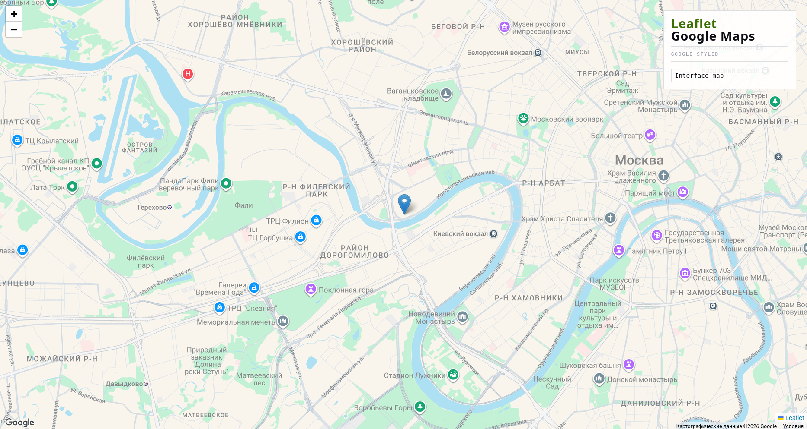

# Leaflet + Google Maps Styled Map

[](https://leafletjs.com/)
[](https://developers.google.com/maps/documentation/javascript)
[](https://www.typescriptlang.org/)
[](https://vite.dev/)
[](https://carto.com/)

A lightweight TypeScript/Vite demonstration that combines **Leaflet** with **Google Maps** as the primary basemap provider and **CARTO** as a fallback.



The project demonstrates styled Google Maps basemaps, runtime style switching, asynchronous provider loading, and graceful fallback without requiring a backend.

---

## Features

* Leaflet-based interactive map
* Google Maps Roadmap rendered through `leaflet.gridlayer.googlemutant`
* Multiple local Google Maps style presets
* Runtime map style switching
* Standard Leaflet marker with popup
* Asynchronous Google Maps loading
* Google Maps authentication validation
* Loading timeout and retry-friendly loader
* Automatic CARTO fallback
* CARTO raster basemap with API key support
* TypeScript with strict type checking
* Vite development and production builds
* No backend or framework required

---

## Architecture

Leaflet acts as the map engine and manages the map instance, marker, controls, and base layers.

Google Maps is loaded separately and connected to Leaflet through GoogleMutant.

If Google Maps cannot be loaded or authenticated, the application switches to the CARTO raster basemap.

```text
                  ┌──────────────────────┐
                  │       Browser        │
                  └──────────┬───────────┘
                             │
                             ▼
                  ┌──────────────────────┐
                  │       Leaflet        │
                  │    Map Controller    │
                  └──────────┬───────────┘
                             │
                  ┌──────────┴───────────┐
                  │                      │
                  ▼                      ▼
          ┌───────────────────┐  ┌───────────────────┐
          │   GoogleMutant    │  │       CARTO       │
          │  Google Maps API  │  │  Raster Fallback  │
          └─────────┬─────────┘  └───────────────────┘
                    │
                    ▼
          ┌───────────────────┐
          │   Google Maps JS  │
          │        API        │
          └───────────────────┘

```

---

## Technology Stack

| Technology                                                                                | Purpose                              |
|-------------------------------------------------------------------------------------------|--------------------------------------|
| [Leaflet](https://leafletjs.com/)                                                         | Map engine and interactive map UI    |
| [Google Maps JavaScript API](https://developers.google.com/maps/documentation/javascript) | Primary basemap provider             |
| [Google Maps JS API Loader](https://www.npmjs.com/package/@googlemaps/js-api-loader)      | Asynchronous Google Maps loading     |
| [GoogleMutant](https://www.npmjs.com/package/leaflet.gridlayer.googlemutant)              | Google Maps integration with Leaflet |
| [TypeScript](https://www.typescriptlang.org/)                                             | Static typing                        |
| [Vite](https://vite.dev/)                                                                 | Development server and bundler       |
| [CARTO](https://carto.com/)                                                               | Fallback raster basemap              |

---

## Requirements

* Node.js 20+
* npm 10+
* Google Cloud project with the Maps JavaScript API enabled
* Google Maps API key
* CARTO Basemaps API key

Check your local versions:

```bash
node --version
npm --version
```

---

## Installation

Clone the repository:

```bash
git clone <repository-url>
cd leaflet-google-map
```

Install dependencies:

```bash
npm install
```

---

## Environment Variables

The application uses Vite environment variables for map provider API keys.

Create `.env` in the project root:

```env
VITE_GOOGLE_MAPS_API_KEY=YOUR_GOOGLE_MAPS_API_KEY
VITE_CARTO_API_KEY=YOUR_CARTO_API_KEY
```

Do not commit `.env` containing real API keys.

The repository should include `.env` in `.gitignore`.

A `.env.example` file can be committed with empty values:

```env
VITE_GOOGLE_MAPS_API_KEY=
VITE_CARTO_API_KEY=
```

Restart the Vite development server after changing `.env`.

---

## Google Maps Configuration

Create or select a project in [Google Cloud](https://console.cloud.google.com/).

Enable the **Maps JavaScript API** and create an API key.

For a browser application, configure HTTP referrer restrictions for the key.

Typical development and production restrictions may look like:

```text
http://localhost:5173/*
https://your-domain.example/*
```

Restrict the key to the APIs required by the application and configure appropriate quotas.

The Google Maps API key is used by the browser and therefore cannot be treated as a secret.

---

## CARTO Configuration

The application uses CARTO raster basemaps as its fallback provider.

CARTO raster tiles require an API key. The key is passed to the tile URL through the `key` query parameter.

The application uses:

```text
https://{s}.basemaps.cartocdn.com/light_all/{z}/{x}/{y}{r}.png?key=YOUR_CARTO_API_KEY
```

Configure the key through:

```env
VITE_CARTO_API_KEY=YOUR_CARTO_API_KEY
```

For local development, the CARTO website restriction can be left empty.

For production, configure appropriate restrictions for the deployed domain through the CARTO Basemaps dashboard.

CARTO and OpenStreetMap attribution must remain visible on the map.

See the [CARTO Basemaps API key documentation](https://carto.com/basemaps/apikey/) for current API key and usage information.

---

## Development

Start the development server:

```bash
npm run dev
```

Vite will display the local development URL in the terminal.

---

## Production Build

Create the production build:

```bash
npm run build
```

The generated files are placed in:

```text
dist/
```

Preview the production build locally:

```bash
npm run preview
```

---

## Project Structure

```text
leaflet-google-map/
├── index.html
├── package.json
├── tsconfig.json
├── vite.config.ts
├── vite-env.d.ts
├── .env
├── .env.example
├── .gitignore
└── src/
    ├── main.ts
    ├── map.ts
    ├── google.ts
    ├── googlemutant.ts
    ├── styles.ts
    └── style.css
```

### `src/main.ts`

Application entry point.

Responsible for:

* application initialization;
* Google Maps and GoogleMutant loading;
* style selector initialization;
* runtime style switching;
* Google Maps → CARTO fallback handling.

### `src/map.ts`

Contains the Leaflet map controller.

Responsible for:

* creating the Leaflet map;
* managing the marker;
* managing the active base layer;
* applying Google Maps styles;
* creating the CARTO fallback layer.

### `src/google.ts`

Handles Google Maps JavaScript API loading and validation.

It:

* reads `VITE_GOOGLE_MAPS_API_KEY`;
* loads the Maps JavaScript API asynchronously;
* prevents duplicate loading attempts;
* applies a loading timeout;
* validates Google Maps authentication;
* clears the cached promise after a failed attempt.

### `src/googlemutant.ts`

Loads the GoogleMutant plugin and registers it against the application's Leaflet instance.

The distributed GoogleMutant build is loaded as a classic script because it expects Leaflet to be available globally.

### `src/styles.ts`

Contains the predefined Google Maps style configurations.

Styles are stored locally and use:

```ts
google.maps.MapTypeStyle[]
```

No external style catalog is required at runtime.

### `src/style.css`

Contains the application's UI and map-related styles.

---

## Map Styles

The application includes multiple predefined Google Maps style presets.

Styles are stored locally in `src/styles.ts` and can be switched at runtime through the map controls.

The application uses `Interface map` as the preferred initial style when it is available.

---

## Google Maps Loading

Google Maps is loaded asynchronously through the Google Maps JS API Loader.

The loading flow is:

```text
Application start
       │
       ▼
Load Google Maps API
       │
       ├── Success
       │      │
       │      ▼
       │   Validate authentication
       │      │
       │      ├── Valid ──► Load GoogleMutant ──► Google map
       │      │
       │      └── Failed ───────────────────────► CARTO
       │
       ├── API error ───────────────────────────► CARTO
       │
       └── Timeout ─────────────────────────────► CARTO
```

A failed loading attempt clears the cached promise, allowing a subsequent attempt to start a new request.

---

## Fallback

Google Maps is the primary basemap provider.

If Google Maps cannot be initialized or authenticated, the application automatically switches to the CARTO raster basemap.

```text
Google Maps
     │
     ├── Available ──► Google styled map
     │
     └── Unavailable ─► CARTO fallback
```

The CARTO fallback uses the configured `VITE_CARTO_API_KEY`.

If neither Google Maps nor the CARTO fallback can be initialized, the application reports the failure to the user.

---

## Security

The Google Maps and CARTO API keys are used by a browser application and therefore cannot be considered secret credentials.

Security should be based on provider-side restrictions rather than attempting to hide the keys from the browser.

### Google Maps

* Restrict the API key by HTTP referrer.
* Restrict the key to the APIs required by the application.
* Configure reasonable quotas.
* Monitor API usage.
* Do not commit `.env` containing the real key.

### CARTO

* Use a dedicated API key for the project.
* Configure appropriate website restrictions for production.
* Monitor tile usage.
* Keep required attribution visible.
* Do not commit `.env` containing the real key.

---

## Troubleshooting

### Google Maps is not loaded

Check:

1. `VITE_GOOGLE_MAPS_API_KEY` is present.
2. The Maps JavaScript API is enabled.
3. The API key is valid.
4. HTTP referrer restrictions allow the current host.
5. The browser can access Google Maps services.
6. The browser console for Google Maps API errors.

If Google Maps cannot be initialized, the application should automatically use CARTO.

### CARTO displays `API KEY REQUIRED`

Check:

1. `VITE_CARTO_API_KEY` is present.
2. The Vite development server was restarted after changing `.env`.
3. CARTO tile requests contain the `key` query parameter.
4. The CARTO key is valid.
5. The browser is not displaying a cached tile.

A hard refresh can be useful after changing the CARTO key:

```text
Ctrl + Shift + R
```

### GoogleMutant is unavailable

GoogleMutant must be loaded after Leaflet is available globally.

The project therefore loads the distributed plugin build as a classic script instead of importing it directly as an ESM module.

---

## Deployment

The project produces a static Vite build and does not require an application server.

Build the project:

```bash
npm install
npm run build
```

Deploy the contents of:

```text
dist/
```

to a static hosting provider.

Before deployment, make sure:

* the Google Maps API key allows the production domain;
* the CARTO key is configured for the production environment;
* required attribution remains visible;
* the required `VITE_*` variables are available during the production build.

The project can be deployed to services such as GitHub Pages, Netlify, Vercel, or other static hosting platforms.

---

## Scripts

| Command           | Description                                |
|-------------------|--------------------------------------------|
| `npm run dev`     | Start the Vite development server          |
| `npm run build`   | Type-check and build the production bundle |
| `npm run preview` | Preview the production build locally       |

---

## License

MIT [License](LICENSE)
