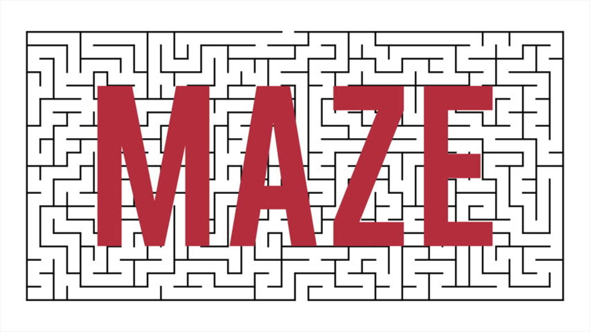

# Maze Generator

[](https://www.npmjs.com/package/@alekstar79/maze-generator)
[](https://bundlephobia.com/package/@alekstar79/maze-generator)
[](https://opensource.org/licenses/MIT)
[](https://www.typescriptlang.org/)
[](https://github.com/alekstar79/maze-ts)

A modern, zero-dependency TypeScript library for generating **perfect mazes** using **Eller's Algorithm** and organic caves using **Cellular Automata**. Designed for seamless integration with Canvas, Vue, React, or any other UI framework.



<!-- TOC -->
* [Maze Generator](#maze-generator)
  * [🚀 Key Features](#-key-features)
  * [📦 Installation](#-installation)
  * [🧩 Basic Usage (Instant Generation)](#-basic-usage-instant-generation)
  * [🎥 Animated Generation (Step-by-Step)](#-animated-generation-step-by-step)
  * [🌍 Cave Generation (Cellular Automaton)](#-cave-generation-cellular-automaton)
  * [🧠 Pathfinding (Wave Algorithm)](#-pathfinding-wave-algorithm)
  * [📚 API Reference](#-api-reference)
  * [🛠️ Development & Demo](#-development--demo)
  * [📝 License](#-license)
  * [🤝 Contributing](#-contributing)
<!-- TOC -->

## 🚀 Key Features

- **Eller's Algorithm** – Guarantees the generation of perfect mazes (no loops, no isolated regions) with a time complexity of `O(N)`.
- **Animated Generation Support** – Built-in generator (`yield`) that yields control after processing each row, enabling smooth step-by-step rendering.
- **Cellular Automaton Cave Generation** – Simulates organic cave structures using configurable `birthLimit` and `deathLimit` rules.
- **Pathfinding** – Integrated Wave Algorithm (BFS) to find the shortest path between any two points.
- **Serialization** – Full support for saving and loading mazes/caves in both human-readable `.txt` and `.json` formats.
- **Strict TypeScript** – Fully typed, offering excellent IDE autocompletion and type safety.
- **100% Test Coverage** – Comprehensive unit tests covering all core functionality (lines, functions, and branches).

## 📦 Installation

```bash
npm install @alekstar79/maze-generator
```

## 🧩 Basic Usage (Instant Generation)

```typescript
import { MazeFacade } from '@alekstar79/maze-generator';

// Create the facade instance
const facade = new MazeFacade();

// Generate a 10x10 maze instantly
facade.generateMaze(10, 10);

// Export the maze in plain text (compatible with original C++ format)
const text = facade.maze.toTXT();
console.log(text);

// Export the maze as JSON
const json = facade.maze.toJSON();
console.log(json);
```

## 🎥 Animated Generation (Step-by-Step)

The library provides a built-in generator that yields after each row is processed, making it perfect for live animation (Canvas, HTML, Vue, etc.):

```typescript
import { MazeFacade } from '@alekstar79/maze-generator';

const facade = new MazeFacade();

// Get the generator
const generator = facade.generateMazeStepByStep(10, 10);

// Iterate with a delay (e.g., 100ms per step)
for await (const processedRow of generator) {
  // processRow is the index of the row just completed.
  // Here you would call your draw/update method.
  await new Promise(resolve => setTimeout(resolve, 100));
  // canvas.drawMaze();
}
```

## 🌍 Cave Generation (Cellular Automaton)

```typescript
facade.generateCave({
  rows: 10,
  cols: 10,
  birthLimit: 4,
  deathLimit: 3,
  chance: 50 // initial alive probability (%)
});

// Step the simulation manually
facade.stepCave();

// Export the cave
console.log(facade.cave.toTXT());
```

## 🧠 Pathfinding (Wave Algorithm)

Once a maze is generated, find the shortest path between two points:

```typescript
const start = { x: 0, y: 0 };
const end = { x: 5, y: 5 };

const path = facade.findPath(start, end);
// path returns an array of { x, y } coordinates
```

## 📚 API Reference

- `MazeFacade` – Main entry point.
- `Maze` – Core maze model with `generateMaze`, `toTXT`, `toJSON`.
- `Cave` – Core cave model with `generateMap`, `updateMap`, `toTXT`.
- `Pacman` – Pathfinding logic.
- `Matrix` – Lightweight 2D boolean matrix for wall representation.

## 🛠️ Development & Demo

This repository includes a `demo/` folder with a complete Vue 3 + Vite application showcasing the library.
To run the demo locally:

```bash
cd demo
npm install
npm run dev
```

## 📝 License

MIT License. See [LICENSE](LICENSE) for more information.


## 🤝 Contributing

Issues and pull requests are welcome! For major changes, please open an issue first to discuss what you would like to change.
