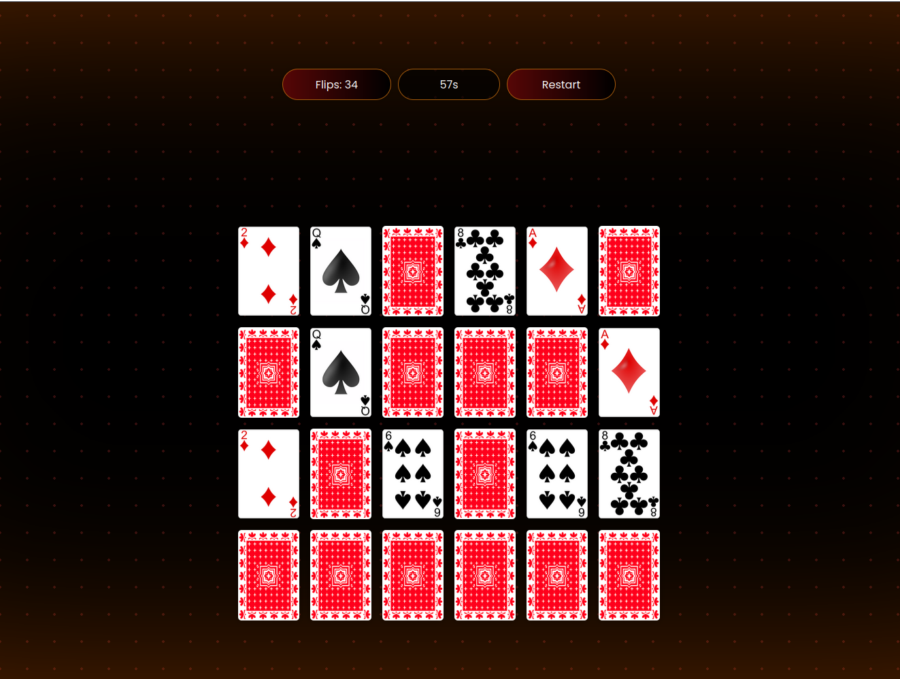

# Memory Card Game

Memory Card Game представляет собой набор из пар одинаковых карточек. Карточки выкладываются «рубашкой» вверх. Задача игрока следующая. Открывая карточки парами (по одной, последовательно), запоминать расположения одинаковых картинок. Когда, за один ход (два клика), открываются две карточки с одинаковыми картинками, пара фиксируется и остается открытой до конца игры. А если открытые подряд две карточки разные, то они переворачиваются обратно. Игра заканчивается, когда все карточки будут открыты. Ценится, и одновременно является показателем внимательности игрока, время, за которое он открыл все карты и число ходов.  
Чем эти показатели меньше, тем лучше.

Использование максимально простое, достаточно просто скачать или клонировать данный репозиторий и запустить индексный файл (index.html)
