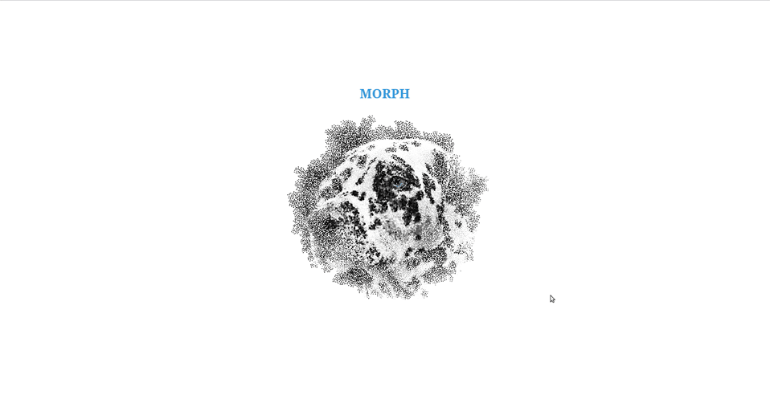

# Morph



[DEMO](https://alekstar79.github.io/morph)

All functionality is implemented using HTML5 and pure JavaScript, no external platform or library is used.

**How to use:**

Just clone or download this repository. Start local server
(LiveServer plugin for VS Code / [serve](https://github.com/vercel/serve) npm package)
or just open index file in browser. That's all...

Clone this repo:
```shell
git clone git@github.com:alekstar79/morph.git
```
Go to project directory:
```shell
cd morph
```
Start server:
```shell
serve -s .
```
