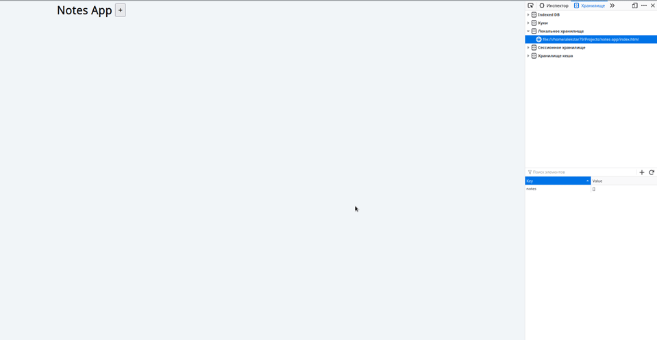

# Notes App



[DEMO](https://alekstar79.github.io/notes-app)

In this notes app, users can do different text records. Records are saved to local storage and loaded when
the application starts. It is possible to edit or delete a note. All functionality are done with HTML5 & pure JavaScript,
no external framework or library is used.

**How to use:**

Just clone or download this repository. Start local server
(LiveServer plugin for VS Code / [serve](https://github.com/vercel/serve) npm package)
or just open index file in browser. That's all...

Clone this repo:
```shell
git clone git@github.com:alekstar79/notes-app.git
```
Go to project directory:
```shell
cd notes-app
```
Start server:
```shell
serve -s .
```
