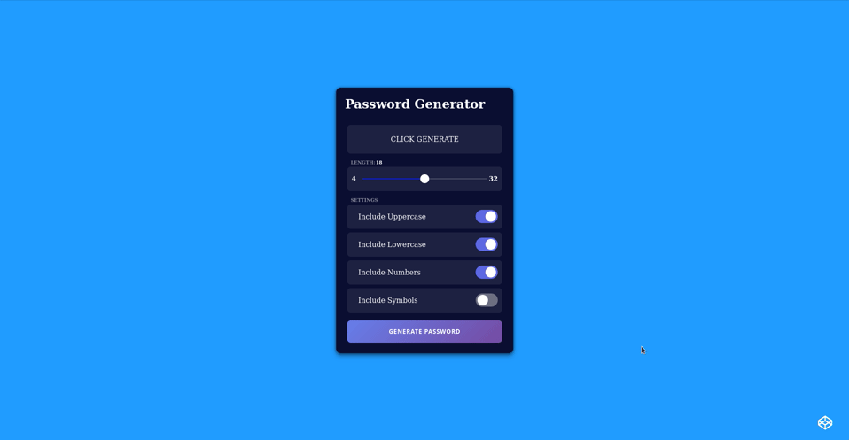

# Password Generator App



| [DEMO](https://alekstar79.github.io/password-generator) | [CODEPEN](https://codepen.io/alekstar79/pen/abMGGNm)  |
|:-------------------------------------------------------:|:-----------------------------------------------------:|

## Installation and usage

Just clone or download this repository. Start local server
(LiveServer plugin for VS Code / [serve](https://github.com/vercel/serve) npm package).
Or just open the index file [ index.html ] in any browser.
That's all...

Clone this repo:
```shell
git clone git@github.com:alekstar79/password-generator.git
```
Go to project directory:
```shell
cd password-generator
```
Start server:
```shell
serve -s .
```
