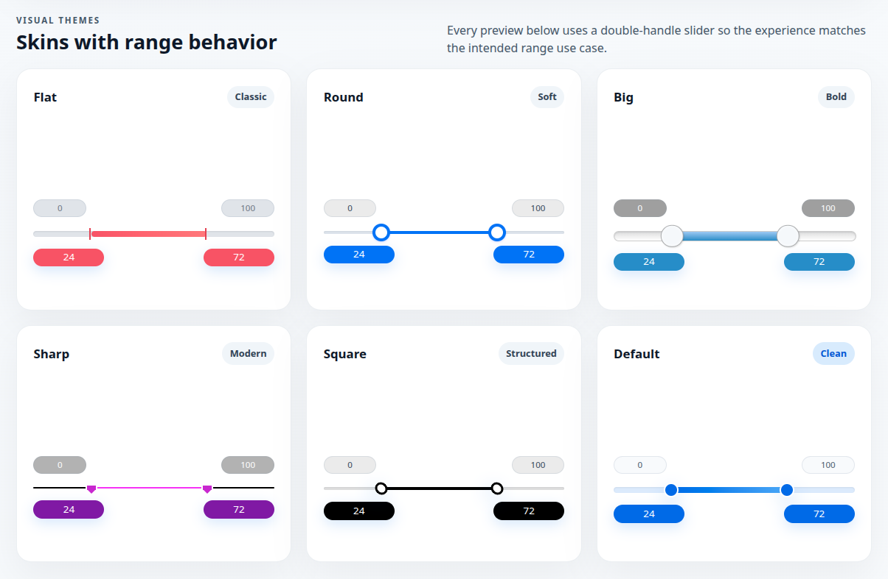

# Range Slider

[](https://www.npmjs.com/package/@alekstar79/range-slider)
[](https://nodejs.org/)
[](LICENSE)
[]()



**[LIVE DEMO](https://alekstar79.github.io/range-slider)**

A modern, TypeScript-first range slider for single and double selection, built for today’s web applications without jQuery or legacy browser shims.

It provides a polished interaction model, flexible configuration, keyboard accessibility, built-in skins, and a small, ergonomic API for integration into any UI.

<!-- TOC -->
* [Range Slider](#range-slider)
  * [Features](#features)
  * [Installation](#installation)
  * [Quick start](#quick-start)
  * [Usage with an input element](#usage-with-an-input-element)
  * [Common options](#common-options)
  * [Events and instance API](#events-and-instance-api)
  * [Demo](#demo)
  * [Development](#development)
  * [License](#license)
<!-- TOC -->

## Features

- Single and double-handle modes
- Pointer and keyboard interaction
- Built-in skins: flat, round, big, sharp, square, and modern
- Optional min/max labels, from/to labels, and grid ticks
- Custom formatting and prettified values
- Works with standalone containers or native input elements
- No jQuery dependency and no IE compatibility layer

## Installation

```bash
npm install @alekstar79/range-slider
```

## Quick start

```ts
import { createRangeSlider } from '@alekstar79/range-slider'
import '@alekstar79/range-slider/style.css'

const host = document.getElementById('slider')

if (host) {
  createRangeSlider(host, {
    type: "double",
    min: 0,
    max: 100,
    from: 20,
    to: 80,
    step: 5,
    skin: "round",
    grid: true,
  })
}
```

```html
<div id="slider"></div>
```

## Usage with an input element

The library can also decorate a native input and keep it in sync with the slider state:

```html
<input id="price" type="text" value="25;75" />
```

```ts
import { createRangeSliderFromInput } from '@alekstar79/range-slider'
import '@alekstar79/range-slider/style.css'

const input = document.getElementById('price') as HTMLInputElement

createRangeSliderFromInput(input, {
  type: "double",
  min: 0,
  max: 100,
  skin: "modern",
  grid: true,
})
```

## Common options

| Option               | Type                        | Default      | Description                                  |
|----------------------|-----------------------------|--------------|----------------------------------------------|
| `type`               | `'single' \| 'double'`      | `'single'`   | Selects one or two handles.                  |
| `min` / `max`        | `number`                    | `10` / `100` | Defines the slider range.                    |
| `from` / `to`        | `number`                    | `10` / `100` | Initial handle positions.                    |
| `step`               | `number`                    | `1`          | Step size for pointer and keyboard movement. |
| `skin`               | `string`                    | `'flat'`     | Chooses the visual theme.                    |
| `grid`               | `boolean`                   | `false`      | Shows tick marks.                            |
| `keyboard`           | `boolean`                   | `true`       | Enables arrow key navigation.                |
| `hide_min_max`       | `boolean`                   | `false`      | Hides the min/max labels.                    |
| `hide_from_to`       | `boolean`                   | `false`      | Hides the from/to labels.                    |
| `prefix` / `postfix` | `string`                    | `''`         | Adds visual decoration to values.            |
| `valueFormatter`     | `(value: number) => string` | `null`       | Custom formatter for labels.                 |
| `disable` / `block`  | `boolean`                   | `false`      | Locks interaction.                           |

## Events and instance API

The slider instance exposes a compact API for updates and event handling:

```ts
import { createRangeSlider } from '@alekstar79/range-slider'

const slider = createRangeSlider(host, { type: 'single' })

slider.on('change', (result) => {
  console.log(result.from, result.to)
})

slider.update({ skin: 'sharp', from: 42 })
slider.destroy()
```

Supported events:

- `start`
- `change`
- `finish`
- `update`

## Demo

A local demo is included in the package sources and can be launched with:

```bash
npm run dev
```

## Development

```bash
npm install
npm test
npm test:coverage
npm run build
```

## License

This project is released under the MIT License. See [LICENSE](LICENSE) 
