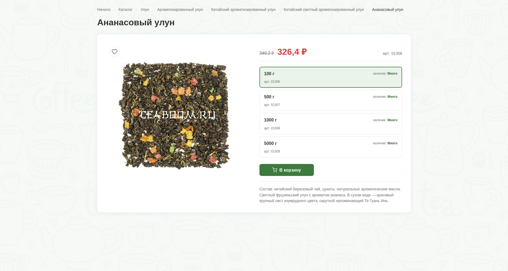

# Карточка товара "Ананасовый улун"



[**LIVE DEMO**](https://alekstar79.github.io/teaboom-product-card)

Вёрстка карточки товара. Чистый HTML5 + SCSS + Vanilla JS, без Bootstrap, jQuery и готовых шаблонов.

---

## Содержание

<!-- TOC -->
* [Карточка товара "Ананасовый улун"](#карточка-товара-ананасовый-улун)
  * [Содержание](#содержание)
  * [Что реализовано](#что-реализовано)
  * [Стек](#стек)
  * [Запуск](#запуск)
  * [Структура проекта](#структура-проекта)
  * [Ключевые технические решения](#ключевые-технические-решения)
    * [Семантическая разметка](#семантическая-разметка)
    * [Архитектура SCSS](#архитектура-scss)
    * [Сетка и раскладка](#сетка-и-раскладка)
    * [Доступность](#доступность)
    * [Выбор фасовки на нативных radio](#выбор-фасовки-на-нативных-radio)
    * [JavaScript](#javascript)
    * [Адаптивность](#адаптивность)
    * [Фоновый паттерн](#фоновый-паттерн)
  * [Что не вошло в реализацию](#что-не-вошло-в-реализацию)
  * [Проверено](#проверено)
<!-- TOC -->

---

## Что реализовано

Верхняя часть карточки товара со всем перечисленным в ТЗ:

| Элемент            | Реализация                                             |
|--------------------|--------------------------------------------------------|
| Изображение        | `<figure>`, ленивая загрузка, увеличение при наведении |
| Название           | `<h1>`                                                 |
| Категория          | Хлебные крошки `<nav>` с `aria-label`                  |
| Выбор фасовки      | `<fieldset>` + 4 нативных `<input type="radio">`       |
| Артикул            | В блоке цены и в каждой карточке фасовки               |
| Актуальная цена    | Крупная, акцентным цветом                              |
| Старая цена        | Зачёркнутая, показывается только при наличии скидки    |
| Кнопка «В корзину» | С состоянием `:hover`, `:focus-visible`, `:active`     |
| Краткое описание   | Секция под формой                                      |

Помимо этого реализованы три дополнительных интерактива:

- **Кнопка «В избранное»** в углу изображения, с подсказкой при наведении и переключением состояния.
- **Модальное окно просмотра изображения** - открывается по клику на фото, закрывается по `Escape`, по клику на фон или на крестик.
- **Уведомление о добавлении в корзину** - всплывает после отправки формы, автоматически исчезает через 5 секунд.

При переключении фасовки обновляются цена, старая цена, артикул и подсветка выбранной карточки.

---

## Стек

- **HTML5** - семантическая разметка, ARIA там, где нужно
- **SCSS** - CSS-переменные, БЭМ-именование, разбиение на файлы, каскадные слои
- **Vanilla JS (ES2015+)** - без фреймворков и сторонних библиотек, ES-модули
- **Intl.NumberFormat** - форматирование цен по правилам `ru-RU`

---

## Запуск

```bash
npm install
npm run sass        # разовая компиляция SCSS в CSS
npm run serve       # локальный сервер на http://localhost:3000
```

Или в режиме отслеживания изменений SCSS:

```bash
npm run sass:watch
```

Скрипты используют ES-модули, поэтому страницу нужно открывать через локальный сервер - по `file://` модули не работают из-за политики безопасности браузера. `npm run serve` поднимает сервер за пару секунд.

---

## Структура проекта

```text
teaboom-product-card/
├── index.html
├── package.json
├── README.md
├── css/
│   └── style.css              ← компилируется из scss/
├── scss/
│   ├── style.scss             ← точка входа
│   ├── _layers.scss           ← порядок каскадных слоёв
│   ├── _variables.scss        ← CSS-переменные темы
│   ├── _reset.scss
│   ├── _base.scss
│   ├── _utilities.scss
│   ├── _breadcrumbs.scss
│   ├── _product.scss
│   ├── _variants.scss
│   ├── _button.scss
│   ├── _lightbox.scss
│   ├── _toast.scss
│   └── _responsive.scss
├── js/
│   ├── main.js                ← оркестратор: DOM, события, вызовы модулей
│   └── modules/
│       ├── variants.js        ← данные и подготовка фасовок
│       ├── lightbox.js        ← открытие и закрытие модалки
│       ├── wishlist.js        ← состояние кнопки избранного
│       └── toast.js           ← показ и скрытие уведомления
└── assets/
    └── images/
        ├── ananas-ulun.jpg
        └── bg-pattern.png
```

---

## Ключевые технические решения

### Семантическая разметка

Карточка обёрнута в `<article>` - это самостоятельный блок контента, который можно переиспользовать (например, в списке товаров каталога).

Все контейнеры выбраны по смыслу:

- `<nav>` для хлебных крошек с `aria-label="Хлебные крошки"`;
- `<h1>` для названия товара - единственный H1 на странице;
- `<figure>` для изображения товара;
- `<fieldset>` и `<legend>` для группы радиокнопок выбора фасовки;
- `<article>` для самой карточки.

Все интерактивные элементы - настоящие, а не имитация из `<div>`: `<a>` для ссылок, `<button type="submit">` для кнопки "В корзину",
`<label>` для переключателей фасовки. Это даёт корректную работу браузерных механизмов доступности без дополнительного кода:
переключение стрелками клавиатуры, клик по всей площади `<label>`, а не только по самому радио.

### Архитектура SCSS

Тема вынесена в CSS-переменные (`_variables.scss`) - единая точка настройки палитры, типографики, отступов, радиусов, теней и анимаций.
Смена фирменного стиля - правка одного файла.

Файлы разделены по назначению:
`_reset`, `_base`, `_utilities` - общие вещи,
`_breadcrumbs`, `_product`, `_variants`, `_button`, `_lightbox`, `_toast` - конкретные компоненты,
`_responsive` - медиазапросы в одном месте.
Точка входа `style.scss`.

Порядок применения стилей управляется **каскадными слоями** (`@layer`). Список слоёв объявлен в `_layers.scss`:
`reset, base, components, responsive, utilities`. Внутри слоя приоритет определяется порядком слоёв, а не специфичностью селекторов.
Это делает каскад предсказуемым: утилитарные классы всегда перебивают компонентные, а компонентные - базовые, независимо от того,
какой селектор написан длиннее. Без `!important` и без хрупких цепочек селекторов.

Именование классов - **БЭМ**: `product__price-block`, `variant-item__name`, `btn--primary`.
Такой подход даёт предсказуемые имена, низкую специфичность селекторов и отсутствие конфликтов между файлами.

### Сетка и раскладка

Карточка построена на **CSS Grid**: две равные колонки - под изображение и под информацию о товаре.
Для колонок используется `minmax(0, 1fr)`, это защищает от неожиданного растягивания колонки длинным
содержимым (типичная ситуация, когда в ячейке оказывается длинное слово без пробелов).

Внутри правой колонки - флекс-контейнер с отступами между блоками. Отдельные группы элементов (иконка и текст в кнопке,
название и артикул в карточке фасовки) тоже выровнены флексом.

Список фасовок - вложенная сетка в одну колонку. Каждая фасовка тоже сетка из двух частей: название слева, наличие справа.
Никаких лишних обёрток - один элемент, один контейнер.

### Доступность

- **Фасовки — нативные радиокнопки**, а не стилизованные блоки `<div>`.
  Пользователь может переключаться между ними стрелками `↑`/`↓` на клавиатуре, а программа чтения с экрана
  корректно сообщает "выбрано" или "не выбрано".
- **Класс `visually-hidden`** скрывает `<legend>` и `<input>` визуально, но оставляет их доступными
  для программ чтения с экрана - это стандартный приём, когда элемент нужен для семантики, но не должен
  отображаться на странице.
- **`aria-live="polite"`** на блоке цены: при переключении фасовки программа чтения с экрана зачитывает новую цену и артикул.
- **`aria-current="page"`** на последней хлебной крошке - семантически верно и подсвечивается в стилях.
- **`:focus-visible`** показывает рамку фокуса только при навигации с клавиатуры, а не при клике мышью.
  Работает и для кнопки, и для скрытой радиокнопки (через `:has(input:focus-visible)`).
- **`alt`** у изображения описывает содержимое, а не "картинка товара".
- **`aria-hidden="true"`** на декоративных иконках корзины и крестика.
- **Модальное окно** имеет `role="dialog"` и `aria-modal="true"`. Фокус при открытии переносится на кнопку закрытия,
  `Tab` удерживается внутри диалога, `Escape` закрывает окно, а после закрытия фокус возвращается на элемент, который его открыл.
- **Кнопка «В избранное»** использует `aria-pressed` - состояние переключателя доступно программам чтения с экрана.

### Выбор фасовки на нативных radio

Это главное архитектурное решение в вёрстке. На оригинальном сайте каждая фасовка - отдельный блок `<div>`
с собственной кнопкой "добавить в корзину". Я использую **группу нативных радиокнопок** внутри `<fieldset>`.

Что это даёт:

- Клавиатура и программы чтения с экрана работают без JavaScript.
- Состояние "выбрано" — это `:checked`, а не CSS-класс, который приходится синхронизировать вручную.
- Выбранная карточка подсвечивается через `:has(input:checked)`, поэтому дублирующая логика на JavaScript не нужна.
- `<label>` вокруг радиокнопки делает кликабельной всю карточку, а не только саму радиокнопку.

### JavaScript

Код разбит на модули: `main.js` - точка входа, `modules/*` - изолированные части логики.
Модули не ищут элементы и не подписываются на события - это делает `main.js`. Модуль получает уже найденные элементы
или просто данные и возвращает результат. Такое разделение позволяет менять логику и не трогать разметку,
а также не плодит скрытые зависимости между частями скрипта.

**Данные отделены от разметки.** Все цены и артикулы лежат в объекте `VARIANTS` в модуле `variants.js` с JSDoc-типом `Record<string, Variant>`.
В HTML только пустые `<span data-js="…">`, куда JavaScript подставляет значения. Если в реальном
приложении данные придут с сервера, достаточно заменить литерал `VARIANTS` на JSON из `fetch` - разметку менять не нужно.

**Цены хранятся числами, а не строками.** `326.40` вместо `'326,40 ₽'`. Форматирование - задача отдельного инструмента,
а не источника данных. Это позволяет не дублировать знак рубля, пробелы и запятые в объекте и менять
правило форматирования в одном месте.

**`Intl.NumberFormat('ru-RU')`** для форматирования чисел: расставляет неразрывные пробелы между разрядами (`1 432 ₽`),
использует запятую как десятичный разделитель (`326,40 ₽`), не требует сторонних библиотек.
Опции `minimumFractionDigits: 0` и `maximumFractionDigits: 2` показывают копейки только там, где они есть.

**Один обработчик событий на весь список фасовок.** Вместо четырёх слушателей на каждую радиокнопку - один на контейнер `.variants__list`.
Работает для всех существующих и будущих вариантов: если завтра добавят фасовку 250 г, менять JavaScript не потребуется.

**Отправка формы перехвачена** через `event.preventDefault()`. Реальный сервер не подключён, но в комментарии отмечено
место, куда встанет запрос `fetch('/cart/add', …)` при подключении корзины.

**JSDoc для типов.** Это не TypeScript, но IDE всё равно подсказывает поля объектов, проверяет сигнатуры и подсвечивает
опечатки. Каждая публичная функция имеет `@param` и `@returns`.

### Адаптивность

Пять контрольных точек: **1440 / 1024 / 768 / 575 / 375**.
Медиазапросы написаны по `max-width`: базовые стили рассчитаны на десктоп, а на меньших экранах
постепенно уменьшаются отступы и меняется раскладка.

Что меняется по контрольным точкам:

- **1024px** - уменьшаются отступы между элементами и внутри карточки, цена и заголовок становятся чуть меньше.
- **768px** - карточка перестраивается из двух колонок в одну. Фото сверху, ограничено по ширине и центрировано.
  Кнопка "В корзину" растягивается на всю ширину.
- **575px** - компактные отступы, уменьшенные шрифты. Артикул в блоке цены переезжает на отдельную строку под ценой
  (иначе не помещается).
- **375px** - минимальные отступы. Всё ещё читается и удобно нажимается.

Помимо медиазапросов, карточка фасовки использует **контейнерные запросы** (`@container`): если правой колонке
достаётся меньше 380 пикселей - неважно, из-за узкого экрана или из-за того, что карточка оказалась в узком сайдбаре, -
фасовка перестраивается в одну колонку, а "наличие" уезжает под название. Так компонент адаптируется к своему контейнеру,
а не к ширине окна.

Горизонтальной прокрутки нет ни на одном разрешении: ширина фотографии зафиксирована через `aspect-ratio`, длинные слова
переносятся штатно, `minmax(0, 1fr)` в колонках сетки не даёт им неожиданно растянуться.

### Фоновый паттерн

Фон взят из оригинальной темы Teaboom - повторяющееся изображение с чайной тематикой. Подключён через `background-image`
и `background-repeat: repeat` на `body`. Карточка товара лежит поверх, на белом фоне с мягкой тенью - это даёт контраст и аккуратный вид.

---

## Что не вошло в реализацию

Согласно ТЗ:

- **Шапка, подвал, боковое меню категорий** - относятся к странице целиком, не к карточке товара.
- **Табы «Описание / Свойства / Отзывы»** - не входят в перечень элементов карточки.
- **Блок «Похожие товары»** - отдельный компонент страницы.
- **Реальная корзина** - серверная часть не подключается по условию ТЗ.
- **Связанные страницы** (оформление заказа, форма отзыва) - вне scope.

---

## Проверено

- Компиляция SCSS без ошибок и предупреждений.
- Отсутствие ошибок в консоли браузера.
- Переключение фасовок мышью и с клавиатуры.
- Открытие и закрытие модального окна разными способами (клик по фото, `Escape`, клик по фону, клик на крестик).
- Показ и автозакрытие уведомления о добавлении в корзину.
- Пять контрольных разрешений: 1440 / 1024 / 768 / 575 / 375.
- Отсутствие горизонтальной прокрутки на всех разрешениях.
