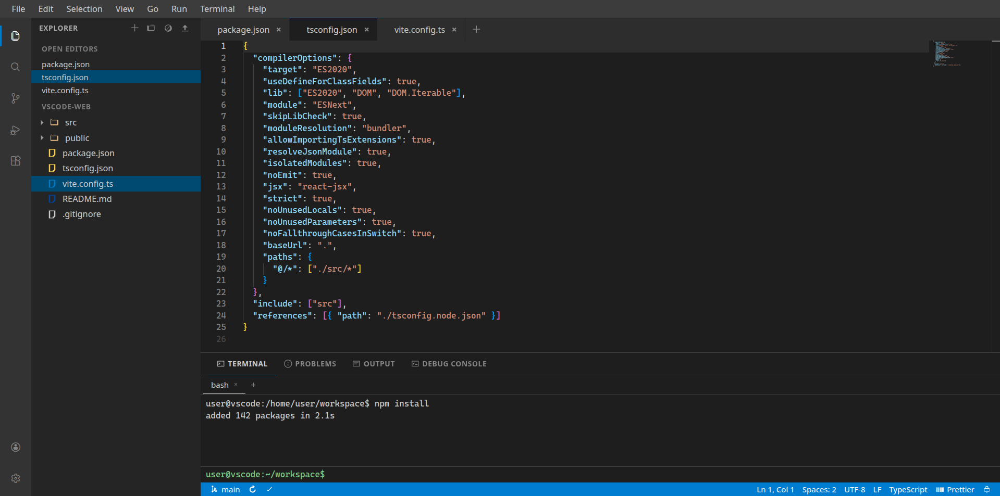

# VS Code Web Replica


A polished, browser-based recreation of the Visual Studio Code experience, built with React, TypeScript, Vite, Tailwind CSS, and Zustand.



## Overview

This project brings the look and feel of VS Code into the browser through a modern single-page interface. It focuses on UI fidelity, interactive workflows, and a familiar developer experience rather than real backend integration.

The result is a highly polished frontend prototype that feels like a real editor shell, complete with a title bar, activity bar, explorer, integrated terminal, command palette, extension marketplace-inspired UI, and Monaco-based editing experience.

The implementation is built around a modular component architecture and centralized state management, making it easy to extend with more editor-like features over time.

## What’s implemented

- A realistic VS Code-like shell with menus, sidebar, tabbed editor, and status bar
- Monaco Editor integration with theme switching and language-aware editing
- Mock filesystem explorer with demo workspace navigation and file opening
- Search panel with regex, case-sensitivity, and replace workflow
- Extensions marketplace UI with install, uninstall, and enable/disable actions
- Terminal panel with shell commands, multiple sessions, and mock Claude REPL
- Keyboard-first interactions: shortcuts, command palette, and view toggles

## Key UI flows

- Open the Explorer, expand folders, and open files into the editor.
- Create or switch editor tabs, edit content, and save using the built-in tab UI.
- Use the command palette to run commands, switch views, or open files quickly.
- Execute terminal commands, create new terminal tabs, and interact with the mock REPL.
- Search across files with filters, inspect results, and navigate to matching locations.
- Browse extensions, install/uninstall them, and toggle enabled state.

## Features

- VS Code-inspired shell layout with a title bar, activity bar, sidebar, editor workspace, and bottom panel
- Monaco-powered editor with tabs, dirty-state indicators, and theme switching
- Explorer view with a demo workspace tree, expand/collapse behavior, and file opening
- Search experience with case, whole-word, regex, and replace support
- Extensions view with filtering, search, install/uninstall actions, and detailed cards
- Bottom panel with Terminal, Problems, Output, and Debug Console tabs
- Interactive terminal with multiple tabs, shell commands, command history, and a Claude-style REPL mode
- Keyboard shortcuts and a command palette for navigation and common actions
- Multiple editor themes, including Dark+, Light+, Solarized, Monokai, and GitHub
- Responsive and visually consistent layout designed to resemble the VS Code interface closely

## Tech Stack

- React 19
- TypeScript
- Vite 7
- Tailwind CSS 3
- Zustand for state management
- Monaco Editor for the editor experience
- cmdk for the command palette
- Radix UI and shadcn-style UI primitives
- Lucide icons and custom icon components
- ESLint and TypeScript tooling for code quality

## Installation

### Prerequisites

- Node.js 18 or newer
- npm

### Install dependencies

```bash
npm install
```

## Running the Project

### Start the development server

```bash
npm run dev
```

Open http://localhost:3000 in your browser.

### Build for production

```bash
npm run build
```

### Preview the production build

```bash
npm run preview
```

### Lint the project

```bash
npm run lint
```

## Project Structure

```text
src/
  App.tsx                  # Root application shell
  main.tsx                 # Application entry point
  index.css                # Global theme variables and VS Code-styled UI
  components/
    CommandPalette.tsx
    layout/                # Title bar, activity bar, sidebar, tabs, panel, status bar
    panel/                 # Problems, Output, Debug Console panels
    sidebar/               # Explorer, Search, SCM, Run & Debug, Extensions views
    terminal/              # Terminal UI and shell command handling
    ui/                    # Shared UI primitives
  data/
    demoWorkspace.ts       # Demo workspace data
    extensions.ts          # Mock extension marketplace data
  hooks/
    useKeyboardShortcuts.ts
  store/
    editorStore.ts         # Editor tabs and split editor state
    extensionStore.ts      # Extension marketplace state
    fileSystemStore.ts     # File tree and file operations
    sidebarStore.ts        # Sidebar navigation and visibility
    terminalStore.ts       # Terminal and panel state
    themeStore.ts          # Theme switching
    workspaceStore.ts      # Terminal-facing workspace abstraction
  utils/
    language.ts            # Language detection helpers
    helpers.ts
```

## Scripts

- npm run dev — start the Vite development server
- npm run build — build the project for production
- npm run preview — preview the built app locally
- npm run lint — run ESLint across the source tree

## Architecture Notes

The application uses Zustand stores to coordinate UI state and workflow state in a centralized way:

- editor state handles tabs, dirty state, and editor splitting
- file system state powers the explorer tree and file interactions
- terminal state controls terminal tabs and bottom-panel visibility
- sidebar state manages active views and resizable layout behavior
- theme state switches between several editor color themes
- extension state powers the mock marketplace experience
- workspace abstractions allow the terminal and explorer to share a consistent demo filesystem model

## Current Status and Limitations

This is a strong frontend prototype rather than a full-featured desktop IDE. Several features are intentionally simulated for the web experience:

- file operations run against an in-browser demo workspace rather than a real local filesystem
- terminal behavior is interactive and command-based, but not connected to a real shell host
- menu actions such as file open, save as, and new window are implemented with browser-friendly fallbacks
- the experience is optimized for visual fidelity and interactivity, not for production-grade remote development workflows

## Why This Project Matters

It demonstrates how a rich developer experience can be recreated in the browser with modern React tooling, clear state management, and careful attention to interface detail. It is a strong foundation for future expansion into a more complete web-based IDE experience and can serve as a polished UI prototype for editor-like applications.
